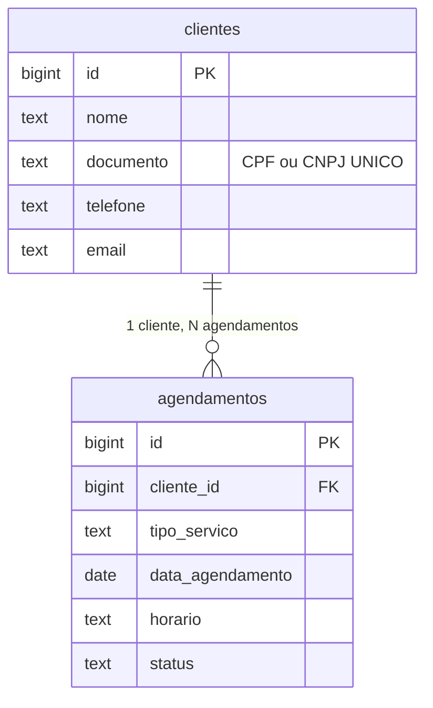

# AgroMáquinas — Sistema de Agendamento de Manutenção

Site institucional + sistema de agendamento de manutenção de máquinas agrícolas.
Frontend estático (HTML/CSS/JS) + backend Python (Flask) + banco de dados PostgreSQL na Supabase.

---

## Documentação passo a passo

Se você está implementando esse sistema pela primeira vez, **siga a documentação nesta ordem**:

1. [`docs/00-LEIA-PRIMEIRO.md`](docs/00-LEIA-PRIMEIRO.md) — Visão geral do projeto e como as peças se conectam
2. [`docs/00.5-INSTALAR-PYTHON-WINDOWS.md`](docs/00.5-INSTALAR-PYTHON-WINDOWS.md) — Instalar Python e aprender o básico do PowerShell
3. [`docs/01-CRIAR-PROJETO-SUPABASE.md`](docs/01-CRIAR-PROJETO-SUPABASE.md) — Criar o projeto na Supabase
4. [`docs/02-RODAR-O-SCHEMA.md`](docs/02-RODAR-O-SCHEMA.md) — Criar as tabelas no banco
5. [`docs/03-PEGAR-AS-CREDENCIAIS.md`](docs/03-PEGAR-AS-CREDENCIAIS.md) — Copiar URL e chave da Supabase
6. [`docs/04-CONFIGURAR-O-BACKEND.md`](docs/04-CONFIGURAR-O-BACKEND.md) — Instalar dependências e configurar `.env`
7. [`docs/05-RODAR-E-TESTAR.md`](docs/05-RODAR-E-TESTAR.md) — Ligar e testar o sistema completo
8. [`docs/06-VER-OS-DADOS.md`](docs/06-VER-OS-DADOS.md) — Navegar no Supabase Studio
9. [`docs/07-PROBLEMAS-COMUNS.md`](docs/07-PROBLEMAS-COMUNS.md) — Troubleshooting (consulte sempre que travar)

---

## Estrutura do projeto

```
.
├── index.html              Tela do cliente (formulário de agendamento)
├── admin.html              Painel administrativo
├── style.css, client.css,
│   admin.css               Estilos
├── utils.js                Funções compartilhadas (API, máscaras, validação)
├── calendar.js             Calendário (cliente) + mini-calendário (admin)
├── client.js               Lógica do formulário de agendamento
├── admin.js                Lógica do painel administrativo
│
├── app.py                  Backend Python (Flask) – API REST
├── schema.sql              Schema do banco PostgreSQL (rodar na Supabase)
├── requirements.txt        Dependências Python
├── .env.example            Modelo do arquivo .env (credenciais)
├── .gitignore              O que NÃO vai pro Git (inclui .env)
│
└── docs/                   Documentação didática passo a passo (PT-BR)
```

---

## Modelo de dados



- Cada cliente é identificado pelo **CPF/CNPJ** (campo `documento`, único).
- Quando o mesmo cliente agenda várias vezes, ele continua tendo **uma única linha** em `clientes`. Só os agendamentos se multiplicam.
- O frontend identifica clientes existentes automaticamente (consulta o backend no `blur` do campo CPF).

---

## Stack técnica

| Camada     | Tecnologia                                           |
| ---------- | ---------------------------------------------------- |
| Frontend   | HTML5 + CSS3 + JavaScript vanilla (sem frameworks)   |
| Backend    | Python 3.10+ + Flask + flask-cors + python-dotenv    |
| Banco      | PostgreSQL via Supabase (cloud)                      |
| Auth       | _Não implementado nesta fase_ (vide Fase 2 abaixo)   |

---

## Como rodar (resumo rápido para quem já configurou tudo)

```powershell
# Na pasta do projeto
venv\Scripts\Activate.ps1
python app.py
```

Em outro PowerShell:

```powershell
python -m http.server 8000
```

Abra http://localhost:8000 no navegador.

---

## Endpoints da API

| Método  | Rota                                  | O que faz                                              |
| ------- | ------------------------------------- | ------------------------------------------------------ |
| GET     | `/api/health`                         | Status do servidor (healthcheck)                       |
| GET     | `/api/clientes/lookup?documento=...`  | Busca cliente por CPF/CNPJ (autopreenchimento)         |
| GET     | `/api/agendamentos`                   | Lista todos os agendamentos (com cliente aninhado)     |
| GET     | `/api/agendamentos/<id>`              | Busca um agendamento específico                        |
| POST    | `/api/agendamentos`                   | Cria agendamento (faz upsert do cliente automaticamente) |
| PUT     | `/api/agendamentos/<id>/status`       | Atualiza o status (pendente / em-andamento / etc.)     |
| PUT     | `/api/agendamentos/<id>/finalizar`    | Finaliza o serviço com relatório                       |
| DELETE  | `/api/agendamentos/<id>`              | Apaga agendamento (cliente permanece)                  |
| GET     | `/api/agendamentos/slots?year=&month=`| Retorna horários ocupados no mês (para o calendário)   |

---

## Fase 2 — Roadmap (não implementado)

- [ ] Login do admin via Supabase Auth
- [ ] Login opcional do cliente para reduzir risco de privacidade no lookup
- [ ] Soft delete de clientes (campo `ativo BOOLEAN`)
- [ ] Hospedagem do backend (Render, Railway, Fly.io, etc.)
- [ ] Notificações por e-mail / WhatsApp ao agendar / finalizar

---

## Licença

Projeto acadêmico. Uso livre para estudo.
