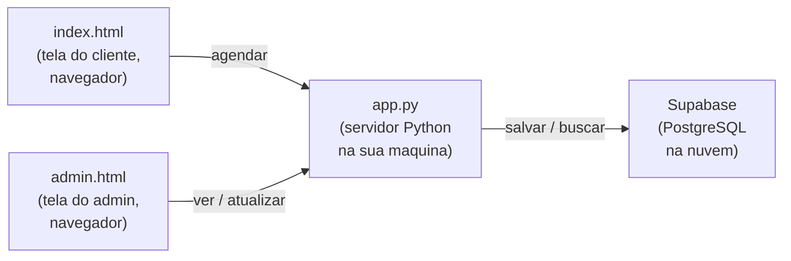
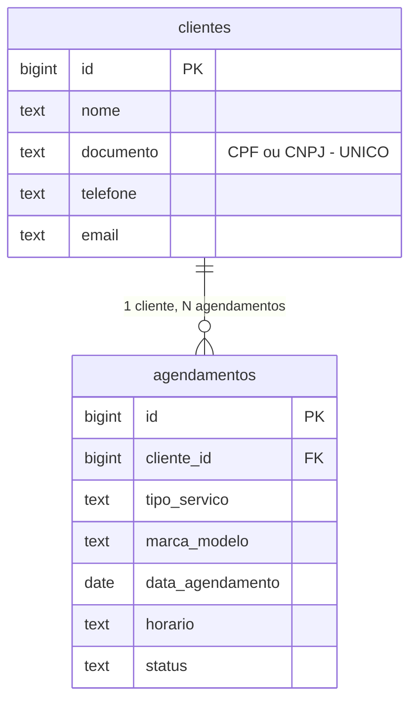

# 00 – Leia primeiro

Bem-vindo! Este documento explica o que você está prestes a fazer e por quê. **Leia até o final antes de seguir para o próximo arquivo** — ele responde dúvidas que costumam aparecer no meio do caminho.

> **Quem deveria ler este guia?**
> Você, que já sabe um pouco de HTML, CSS e JavaScript, mas nunca trabalhou com banco de dados, Python ou terminal. Os documentos foram escritos pensando exatamente nesse perfil. Vamos com calma.

---

## O que é o projeto AgroMáquinas?

É um site para uma empresa que faz **manutenção de máquinas agrícolas** (tratores, colheitadeiras, etc.). Tem duas telas principais:

- **`index.html`** — Tela do **cliente**: ele escolhe o tipo de serviço, descreve o problema, escolhe data e horário, e confirma. Já existe e funciona.
- **`admin.html`** — Tela do **administrador**: ele vê a lista de agendamentos, marca como "em andamento" ou "finalizado", escreve o relatório. Já existe e funciona.

**O que está faltando hoje:** os dados não ficam salvos em lugar nenhum. Se você fizer um agendamento na tela do cliente, ele some quando você fecha o navegador. **O objetivo destes guias é fazer os dados ficarem salvos para sempre, num banco de dados real.**

---

## O que é um banco de dados?

Pense no **caderno de uma marcenaria** onde o dono anota cada encomenda:

> _12/03 – Mesa de jantar – João da Silva – telefone 99999-1234 – entrega em 25/03_

Esse caderno é, na essência, um banco de dados:

- Cada **linha** é uma encomenda
- Cada **coluna** (data, peça, cliente, telefone, entrega) é uma informação sobre essa encomenda
- O caderno guarda tudo, mesmo que o dono feche e abra de novo amanhã

Um **banco de dados digital** faz a mesma coisa, mas com vantagens:

- Não acaba o espaço como num caderno físico
- Você consegue **buscar** ("me mostra todas as encomendas do João da Silva" em 1 segundo)
- Várias pessoas podem usar ao mesmo tempo sem brigar pelo caderno
- Você pode **proteger** algumas colunas (por exemplo: o ajudante vê o nome da peça, mas não vê o telefone do cliente)

No nosso projeto, esse "caderno digital" é o **PostgreSQL**.

---

## Mas e o tal de Supabase?

**PostgreSQL** é o banco em si (o "caderno"). Mas pra usar PostgreSQL você normalmente precisa:

1. Instalar o programa no seu computador
2. Configurar usuário, senha, portas
3. Manter ele ligado o tempo todo
4. Fazer backup
5. Cuidar da segurança

Pra um aluno isso é **muito trabalho**. É aí que entra a **Supabase**: ela é uma empresa que cuida de tudo isso para você. Você cria uma conta, e em 2 minutos tem um PostgreSQL rodando na nuvem, gratuito, com um painel bonitinho pra ver os dados.

> **Analogia rápida:** PostgreSQL é o caderno. Supabase é uma loja que: aluga o caderno pra você, deixa numa estante segura, organiza, faz backup, e te dá uma chave pra acessar quando quiser.

---

## "Mas eu tinha ouvido falar em MySQL..."

MySQL é **outro** banco de dados, popular em cursos de faculdade. **Não é igual** ao PostgreSQL, mas faz coisas parecidas (assim como Honda e Toyota são marcas de carro diferentes que ambas te levam de um lugar a outro).

Importante saber:

- **A Supabase só funciona com PostgreSQL.** Não dá pra usar MySQL na Supabase.
- O código deste projeto está pronto para PostgreSQL.
- Tudo que você aprende em PostgreSQL aqui se aplica diretamente a MySQL no futuro — a sintaxe muda em 5%.

Em resumo: **estamos usando PostgreSQL** (que é o que a Supabase oferece), mas o conhecimento é transferível.

---

## Como as peças do projeto se encaixam

Lendo o diagrama da esquerda pra direita:

1. O **cliente** abre `index.html` no navegador e preenche o formulário.
2. Ao clicar em "Confirmar", o navegador envia os dados para o **`app.py`** (que é um servidor Python rodando no seu computador).
3. O `app.py` recebe, valida, e envia para a **Supabase**, onde fica salvo de verdade.
4. Quando o **admin** abre `admin.html`, o mesmo `app.py` busca os dados na Supabase e mostra na tela.

> **Por que tem o `app.py` no meio? Não dava pra falar direto com a Supabase?**
> Tecnicamente daria, mas seria **inseguro**. O `app.py` é o "porteiro" — ele guarda a chave que abre o banco e nunca entrega ela pro navegador. Isso impede que um cliente mal-intencionado mexa em coisas que não deveria. Você vai entender melhor no [`docs/03-PEGAR-AS-CREDENCIAIS.md`](03-PEGAR-AS-CREDENCIAIS.md).

---

## Como os dados ficam organizados no banco

Vamos guardar tudo em **duas tabelas**:

- **Tabela `clientes`:** uma linha por cliente. Se o João da Silva faz 10 agendamentos, ele tem **uma única linha** aqui.
- **Tabela `agendamentos`:** uma linha por agendamento. Se o João fez 10, são **10 linhas** aqui — e cada uma "aponta" pra linha dele em `clientes` através do campo `cliente_id`.

> Essa ideia de **separar em tabelas e ligar uma na outra** se chama _normalização_. Você vai entender no detalhe no [`docs/02-RODAR-O-SCHEMA.md`](02-RODAR-O-SCHEMA.md). Por enquanto, basta saber: **mesmo cliente nunca aparece duplicado** no banco.

---

## A ordem dos documentos

Você **precisa seguir nessa ordem**:

| Doc                                                              | Onde você está | O que vai fazer                                                                |
| ---------------------------------------------------------------- | -------------- | ------------------------------------------------------------------------------ |
| [`00-LEIA-PRIMEIRO.md`](00-LEIA-PRIMEIRO.md)                     | **Aqui agora** | Entender o que vamos fazer (este arquivo)                                      |
| [`00.5-INSTALAR-PYTHON-WINDOWS.md`](00.5-INSTALAR-PYTHON-WINDOWS.md) | Computador     | Instalar Python no Windows e aprender o básico do PowerShell                   |
| [`01-CRIAR-PROJETO-SUPABASE.md`](01-CRIAR-PROJETO-SUPABASE.md)   | Navegador      | Entrar na sua conta Supabase e criar um projeto vazio                          |
| [`02-RODAR-O-SCHEMA.md`](02-RODAR-O-SCHEMA.md)                   | Navegador      | Criar as tabelas no banco rodando o arquivo `schema.sql`                       |
| [`03-PEGAR-AS-CREDENCIAIS.md`](03-PEGAR-AS-CREDENCIAIS.md)       | Navegador      | Copiar URL e chave do projeto Supabase                                         |
| [`04-CONFIGURAR-O-BACKEND.md`](04-CONFIGURAR-O-BACKEND.md)       | Computador     | Instalar dependências do Python, criar o arquivo `.env`                        |
| [`05-RODAR-E-TESTAR.md`](05-RODAR-E-TESTAR.md)                   | Computador     | Ligar o backend, fazer um agendamento de teste, ver os dados aparecerem        |
| [`06-VER-OS-DADOS.md`](06-VER-OS-DADOS.md)                       | Navegador      | Aprender a navegar no painel da Supabase para ver/filtrar dados                |
| [`07-PROBLEMAS-COMUNS.md`](07-PROBLEMAS-COMUNS.md)               | Quando der erro | Lista de erros conhecidos e como resolver. Volte aqui sempre que travar.       |

**Tempo total estimado:** ~1h30min se nada der errado.

---

## Antes de começar, prepare:

- [ ] Acesso à conta de e-mail `samucamartins1803@gmail.com`
- [ ] Senha da sua conta Supabase (você já tem)
- [ ] Conexão de internet estável
- [ ] Editor de código aberto na pasta do projeto (VS Code, Sublime, qualquer um)
- [ ] **Um caderno físico ou bloco de notas digital** — você vai anotar 3 informações importantes durante o caminho

> **Por que anotar num caderno?** Você vai gerar uma senha do banco de dados e duas "chaves" da Supabase. Se você perder, é meio trabalhoso recuperar. Anote em local seguro **mas não no Git**.

Pronto? Vai pro próximo: [`00.5-INSTALAR-PYTHON-WINDOWS.md`](00.5-INSTALAR-PYTHON-WINDOWS.md).
